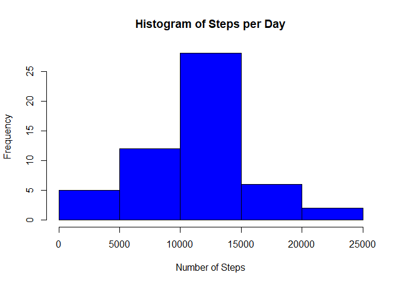
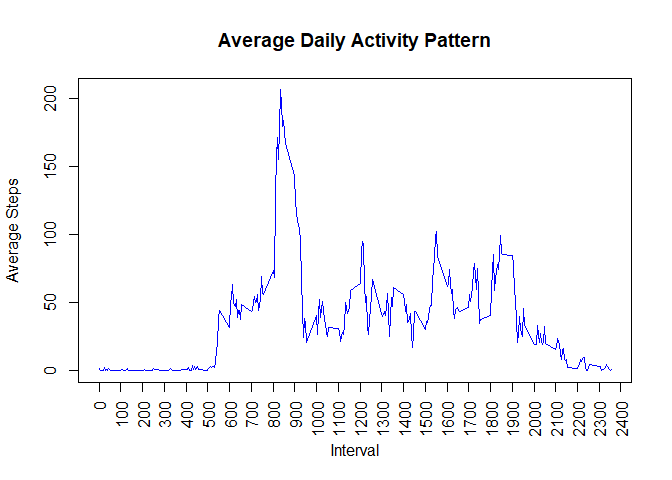
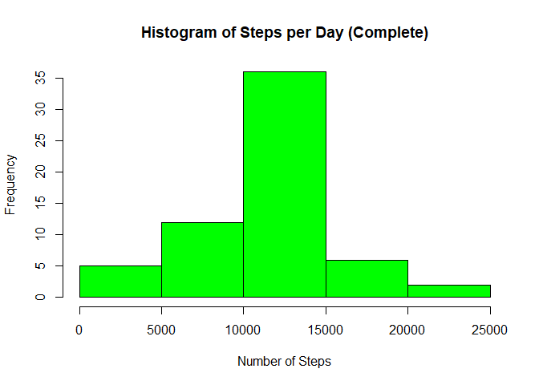
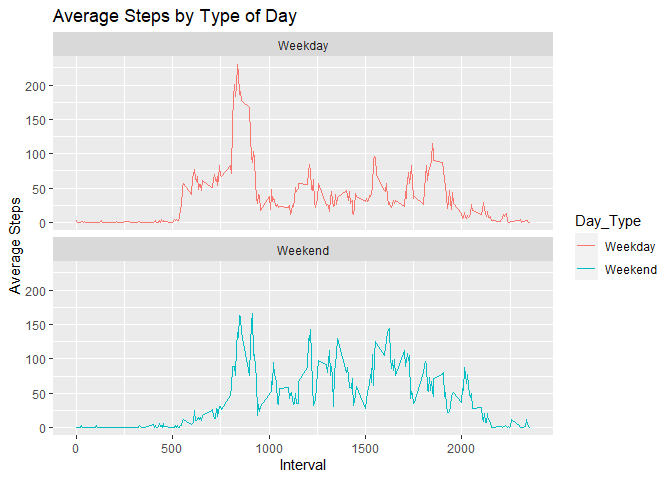

------------------------------------------------------------------------

**Introduction**
----------------

This assignment makes use of data from a personal activity monitoring
device. This device collects data at 5 minute intervals throughout the
day. The data consists of two months of data from an anonymous
individual collected during the months of October and November 2012 and
include the number of steps taken in 5 minute intervals each day.

Download the data
[here](https://d396qusza40orc.cloudfront.net/repdata%2Fdata%2Factivity.zip).

------------------------------------------------------------------------

**Assignment**
--------------

### 1. Code for reading in the dataset and/or processing the data

First, the data is loaded using the *read.csv()* function:

    ## Setting the working directory
    setwd("C:/Users/Andrea/Desktop/RepData_PeerAssessment1")
    ## Importing data
    data <- read.csv(file = "activity.csv")
    ## Getting information about the variables
    str(data)

    ## 'data.frame':    17568 obs. of  3 variables:
    ##  $ steps   : int  NA NA NA NA NA NA NA NA NA NA ...
    ##  $ date    : chr  "2012-10-01" "2012-10-01" "2012-10-01" "2012-10-01" ...
    ##  $ interval: int  0 5 10 15 20 25 30 35 40 45 ...

As we can see, there are **17568 observations** with information
regarding **3 variables**:

-   **steps**: Number of steps taken in a 5-minute interval (missing
    values are coded as *NA*)  
-   **date**: The date on which the measurement was taken in YYYY-MM-DD
    format
-   **interval**: Identifier for the 5-minute interval in which the
    measurement was taken

Then, the **date** values are transformed from *character* to *date*
class in order to simplify further analyses:

    ## Converting to date class
    data$date <- as.Date(data$date, format = "%Y-%m-%d")
    class(data$date)

    ## [1] "Date"

### 2. Histogram of the total number of steps taken each day

First, using the *dplyr* package, the data is grouped by date and the
total steps per day are calculated:

    ## Loading dplyr package
    suppressPackageStartupMessages(library(dplyr)) 
    ## Grouping data by date
    prespd <- group_by(data,date)
    ## Getting total steps per day
    spd <- suppressMessages(summarise(prespd, total_steps = sum(steps))) 

The data is now available as total steps per date:

    ## # A tibble: 5 x 2
    ##   date       total_steps
    ##   <date>           <int>
    ## 1 2012-10-01          NA
    ## 2 2012-10-02         126
    ## 3 2012-10-03       11352
    ## 4 2012-10-04       12116
    ## 5 2012-10-05       13294

Then, from the summarized data, a histogram of the total number of steps
taken each day is built using the base plotting system:

    hist(spd$total_steps, main = "Histogram of Steps per Day", 
         xlab = "Number of Steps", ylab = "Frequency", col = "blue")

### 3. Mean and median number of steps taken each day

The mean and median of the total steps taken per day are calculated
using the previously summarized data:

    mean(spd$total_steps, na.rm = TRUE)

    ## [1] 10766.19

    median(spd$total_steps, na.rm = TRUE)

    ## [1] 10765

### 4. Time series plot of the average number of steps taken

First, using the *dplyr* package, the data is grouped by interval and
the average steps per interval are calculated:

    ## Grouping data by interval
    preadp <- group_by(data, interval)
    ## Getting average steps per interval
    adp <- suppressMessages(summarise(preadp, average_steps = mean(steps, na.rm = TRUE)))

The data is now available as average steps per interval:

    ## # A tibble: 5 x 2
    ##   interval average_steps
    ##      <int>         <dbl>
    ## 1        0        1.72  
    ## 2        5        0.340 
    ## 3       10        0.132 
    ## 4       15        0.151 
    ## 5       20        0.0755

Then, from the summarized data, a line plot of the average number of
steps taken per interval is built using the base plotting system:

    plot(adp$interval, adp$average_steps, type = "l", col = "blue",
         main = "Average Daily Activity Pattern", xlab = "Interval",
         ylab = "Average Steps", xaxt = "n")
    axis(side = 1, at = seq(0, 2400, by = 100), las = 2)

### 5. The 5-minute interval that, on average, contains the maximum number of steps

In order to obtain the 5-minute interval with the maximum number of
steps, the *which.max()* function is used to determine the row location
of the maximum value and then subset the corresponding interval:

    adp[which.max(adp$average_steps),]$interval

    ## [1] 835

    max(adp$average_steps)

    ## [1] 206.1698

Interval **835** has, on average, the maximum number of steps with
**206.1698** steps.

### 6. Code to describe and show a strategy for imputing missing data

First, the amount of *NA* values is obtained by negating the
*complete.cases()* function:

    sum(!complete.cases(data))

    ## [1] 2304

Then, the missing values are filled with the rounded average of the
corresponding interval. The *if.else()* function is used to replace only
the *NA* values by matching the interval from the complete data set with
the interval from the data set constructed in step 5. and assigning the
corresponding average. A new variable named *complete\_steps* is created
with the complete data:

    data$complete_steps <- ifelse(is.na(data$steps),
                                  round(adp$average_steps[match(data$interval, adp$interval)],0), 
                                  data$steps)

Finally, a new data set is created with missing data filled in:

    all_data <- data.frame(Steps = data$complete_steps, Date = data$date,
                           Interval = data$interval)

The new data frame looks like the following:

    head(all_data, n=10)

    ##    Steps       Date Interval
    ## 1      2 2012-10-01        0
    ## 2      0 2012-10-01        5
    ## 3      0 2012-10-01       10
    ## 4      0 2012-10-01       15
    ## 5      0 2012-10-01       20
    ## 6      2 2012-10-01       25
    ## 7      1 2012-10-01       30
    ## 8      1 2012-10-01       35
    ## 9      0 2012-10-01       40
    ## 10     1 2012-10-01       45

### 7. Histogram of the total number of steps taken each day after missing values are imputed

A second histogram of the total number of steps taken per day is built
with the complete data:

    ## Grouping complete data by date
    histcomp0 <- group_by(all_data, Date)
    ## Getting total steps per date
    histcomp <- suppressMessages(summarise(histcomp0, Total_Steps = sum(Steps)))
    ## Building histogram with base plotting system
    hist(histcomp$Total_Steps, main = "Histogram of Steps per Day (Complete)", 
         xlab = "Number of Steps", ylab = "Frequency", col = "green")

The mean and median of the total steps taken per day are recalculated
with the complete data:

    mean(histcomp$Total_Steps, na.rm = TRUE)

    ## [1] 10765.64

    median(histcomp$Total_Steps, na.rm = TRUE)

    ## [1] 10762

By comparing these values with the ones previously obtained *(mean:
10766.19, median: 10765)*, it can be noted that imputing missing data
causes the mean and median values to go down.

### 8. Panel plot comparing the average number of steps taken per 5-minute interval across weekdays and weekends

First, a new factor variable with two levels - *weekday* & *weekend* was
created by obtaining the weekday from the dates and then evaluating the
day type with the *if.else()* function:

    ## Getting weekday from the dates
    Weekday <- weekdays(all_data$Date)
    ## Adding weekday variable to data frame
    all_data_wk <- cbind(all_data, Weekday)
    ## Classifying days in "weekday" or "weekend"
    all_data_wk$Day_Type <- ifelse(all_data_wk$Weekday == "Saturday" | 
                                       all_data_wk$Weekday == "Sunday", "Weekend", "Weekday")

The new data frame looks like this:

    ##   Steps       Date Interval Weekday Day_Type
    ## 1     2 2012-10-01        0  Monday  Weekday
    ## 2     0 2012-10-01        5  Monday  Weekday
    ## 3     0 2012-10-01       10  Monday  Weekday
    ## 4     0 2012-10-01       15  Monday  Weekday
    ## 5     0 2012-10-01       20  Monday  Weekday

Finally, a panel plot of the average daily steps by type of date is
created with the ggplot2 plotting system:

    ## Grouping data by interval
    prepanel <- group_by(all_data_wk, Interval, Day_Type)
    ## Getting the average steps per interval
    panel <- suppressMessages(summarise(prepanel, Average_Steps = mean(Steps, na.rm = TRUE)))
    ## Building panel plot
    library(ggplot2)
    panelplot <- ggplot(panel, aes(x = Interval, y = Average_Steps, 
                                   color = Day_Type)) + geom_line() + 
        facet_wrap(.~Day_Type, ncol = 1, nrow = 2) + 
        labs(x = "Interval", y = "Average Steps", title = "Average Steps by Type of Day")
    ## Displaying plot
    print(panelplot)

